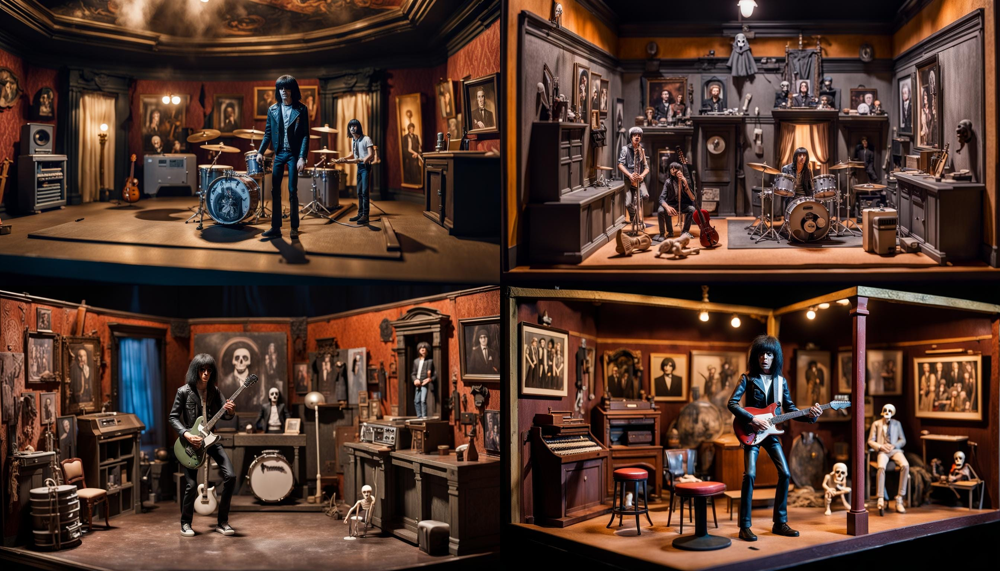

# Welcome

## About Me

With over 30 years of accomplished leadership in software engineering, I bring deep expertise in cloud platforms, infrastructure automation, and optimizing delivery pipelines. My career spanning web development, DevOps, and Agile methodologies equipped me with a wealth of technical knowledge. Now retired, I embrace the freedom to pursue meaingful freelance projects.  If you have need of technical consulting or engineering, let's connect!

* Blockchain smart contract developement

* Ethereum + Solidity

* Solana + Rust

* GIS, QGIS, MapBox, ArcGIS

* AI Photography

## Skills

### Web3 Development

#### Solana Blockchain

My [Solana Payments/Donate](https://github.com/balexander123/buy-me-some-sol.git) landing page allows payment transfers utilizig Solana Pay to accept $USDC payments or donations.

Solana blockchain development, smart contracts with Rust, testnets and faucets.  Web3 UI with React/NextJS deployed to Vercel.

#### Ethereum Blockchain

My [Ethereum Donation page](https://github.com/balexander123/RTW3-Week2-BuyMeACoffee-Contracts) accepts ETH transfers to my Ethereum account.

Ethereum blockchain development, Solidity smart contracts, testnetsnand faucets.  Web3 UI with React/NextJS deployed to Vercel or Replit.

### Historical Story Telling

The project explores the first encounter between Spanish explorers in the San Francisco Bay Area. It utilizes JavaScript and Mapbox APIs to create an interactive map-based narrative of the Portla expedition.

[Ohlone contact with Portolá expedition of 1769](https://balexander123.github.io/seep-city-story/).

### Seep City

The [Seep City](https://seepcity.org/) project documents and reveals the lost seeps, springs and creeks of early San Francisco and pre settlement watersheds.

## Web 3 Development

### Focus Projects

#### Solana Donate To Me Page

My [Solana Payments/Donate](https://github.com/balexander123/buy-me-some-sol.git) landing page allows payment transfers utilizig Solana Pay to accept $USDC payments or donations.

#### Ethereum Donate To Me Page

My [Ethereum Donation page](https://github.com/balexander123/RTW3-Week2-BuyMeACoffee-Contracts) accepts ETH transfers to my Ethereum account.

#### Online Store Presence - Shop Landing Page

My [Service and Merchandise landing page](https://github.com/balexander123/solana-pay-starter.git) allows purchase of services and goods utilizing Solana Pay accepting $USDC.

## Prompt Engineering, Generative Art

### Generative Art

#### DALL·E

A close-up, black & white studio photographic portrait of Jimi Hendrix, dramatic backlighting, 1970s photo from Life Magazine

#### Stable Diffusion

Cinematic cutaway view inside haunted mansion diorama | Medium shot portrait of [band member] within rooms of mansion | populated with ghost, ghouls, spooky dolls and clowns [Joey Ramone, Johnny Ramone, Dee Dee Ramone, Tommy Ramone]

#### Video

Gen-2 from Runway

Pika Labs

#### AI Photography

Medium shot portrait photograph in the style of Yousuf Karsh, prime lens, available window lighting <lora:MyFace:1.0>

## How to contact with me for work

* My [LinkedIn profile](https://www.linkedin.com/in/barry-alexander-9169553/)
* Connect on [Alignable](https://www.alignable.com/biz?_tid=2336716)

## Payment methods

* Zelle
* Venmo
* ETH
* Solana Pay
